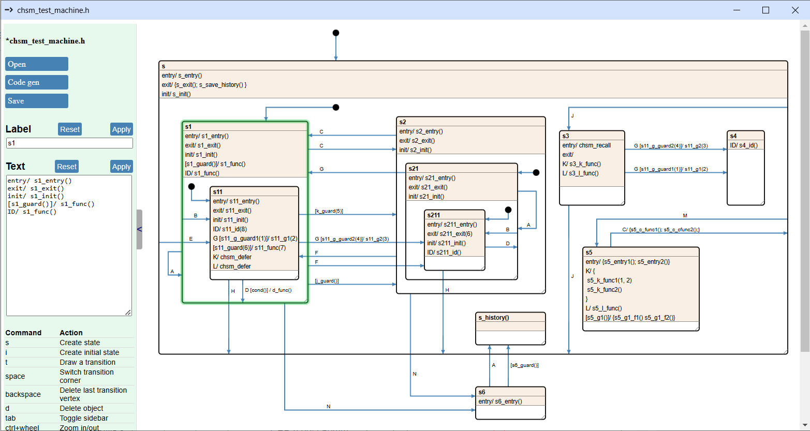

# CHSM - Hierarchical State Machine (HSM) toolkit

:warning: **Experimental code, expect breaking changes.**

The project has two main components:  

- **Cgen**: A straightforward GUI tool for drawing state machines and generating code using Jinja2 templates. [Cgen Documentation](doc/index.md)
- **CRF (C Reactive Framework)**: A C library providing advanced state machine features, such as event queuing and event deferral.  

## Cgen:

### Features
- **Precalculated Transition Paths**: The code generator determines all the functions to be called during a state transition upfront. This ensures that every event is handled in a single pass, avoiding the need for repeated calls to handle events in parent states.  
- **State Machine Flattening**: The generator simplifies the state hierarchy by retaining only leaf states (states without children), merging parent event handlers into them, and discarding complex states. This approach enables the generation of straightforward and readable `switch-case` code, even for complex hierarchical state machines.
- **Minimalist Design**: Keeps the interface simple and focused.
- **No Surprise Policy**: Objects on the drawing move only when you move them or something they're attached to. Lines won't snap to strange positions unexpectedly.  
- **Standard HTML File Format**: Drawings are saved as standard HTML files, viewable in any browser.  
- **Language-Independent Code Generation**: Achieved through Jinja templates. [Template design tutorial](doc/ch2_minimal_python_codegen/minimal_python_codegen.md)  
- **Draw.io Export**: Allows exporting diagrams for broader compatibility.
- **Job Descriptor-Based Outputs**: Code generation outputs are fully defined in a job descriptor file.
- **Notes**: Function and signal identifiers can include notes that appear as popups when you hover over them with the mouse.

### Installation

1. Install a recent Python version (minimum supported version: 3.7)
2. Install dependencies:
   * eel
   * docopt
   * jinja2

   You can install the packages like this:
   `pip3 install eel docopt jinja2`

### Usage
1. Clone this repo
3. Navigate into the **chsm** folder, open a command prompt and run this command:
   `python3 cgen/chsm_backend.py`

The result should be a new window with a simple state machine already in it.

## CRF:

CRF (C Reactive Framework) draws significant inspiration from Miro Samek's excellent book, [Practical UML Statecharts in C/C++](http://www.state-machine.com/psicc2/). If you're new to UML statecharts, this book is a great starting point. The first few chapters offer clear explanations of the essential concepts, supported by easy-to-follow examples.

**CRF Features:**  
- **Run-to-completion (RTC) execution model**  
- **C99 implementation**: Uses C11 atomics when available; otherwise, the application must define two simple atomic functions.  
- **Function-based states**: Each state is implemented as a function that processes events using a `switch` statement.  
- **Optional event pools**: Provide O(1) dynamic memory management to simplify buffering for modules.  
- **Wait-free event queues**: Multi-producer, single-consumer event queues for each state machine.  
- **Deferred and recalled events**: Support for deferring events and recalling them when needed.  
- **Interrupt-safe event generation**: Events can be generated and distributed safely from interrupt contexts.  
- **Event generators**: Built-in support for generating events from "analog" `int32` values and `uint8_t` bitfields.  
- **Unit testing**: Includes tests using the Unity framework.  

## Motivation

After reading [*Practical UML Statecharts in C/C++*](http://www.state-machine.com/psicc2/) (*The Book*), I became convinced of the importance of state machines and reactive code in embedded systems. It also hit me that the only way to keep source code documentation truly up-to-date is to generate the code from the documentation itself. Too often, I've seen beautiful documentation fall out of sync with the code because it was treated as an afterthought—written once the code was *done*. And let's face it, code is rarely *done*. Released? Maybe. But finished? Hardly.

According to *The Book*, most embedded applications can be broken down into independent state machines linked by event queues. If you can see the state charts and event data structures, you can get a solid understanding of what an application does. This realization was particularly relevant as I found myself increasingly tasked with firmware analysis at work. 

It often went something like this: "Hey, could you figure out why this motor driver suddenly started generating screeching dubstep music at a customer's site? Here’s the code." And as I dug in, I’d find out that the code had been running flawlessly for a decade across hundreds of deployments. No one had touched the source in 15 years, and the engineer who originally wrote it had left the company five years ago. 

The issue wasn’t with the hardware—it had been swapped out twice, and both replacements showed the same problem. The fault was in the firmware. This experience made me appreciate how invaluable reliable, up-to-date documentation is when dealing with large, legacy codebases. It’s one thing to inherit someone else’s code; it’s another to inherit their lack of documentation.

So just for fun, I decided to create my own state machine framework as a learning exercise. I wanted to explore how effective this docs-first approach could be on my own terms, without the pressure of deadlines. However, finding a purpose-built state machine drawing tool was challenging. I tried PlantUML to avoid building a GUI from scratch, but it quickly fell apart for anything beyond simple diagrams. Complex state machines became unmanageable, requiring hours to organize arrows and maintain readability, and even the smallest changes would mess everything up again. It became ovious that it would be easier to organize transitions manually than to wrestle with PlantUML.  

Since I already knew Python, I initially wanted to use Tkinter to build the GUI. Unfortunately, the lack of antialiasing made the drawings look terrible. GTK and Qt were viable options, but installing them can be fiddly and did not want them as dependency. Finally, I realized that SVG rendered in the browser would look great, allow saving the drawings as-is, and communication between the browser and a Python backend would be simple by using the Eel package. That approach worked, and I kept adding features until I had roughly what I needed.

I began using the code generator and the C framework for my projects, implementing features as new requirements and ideas came up.
