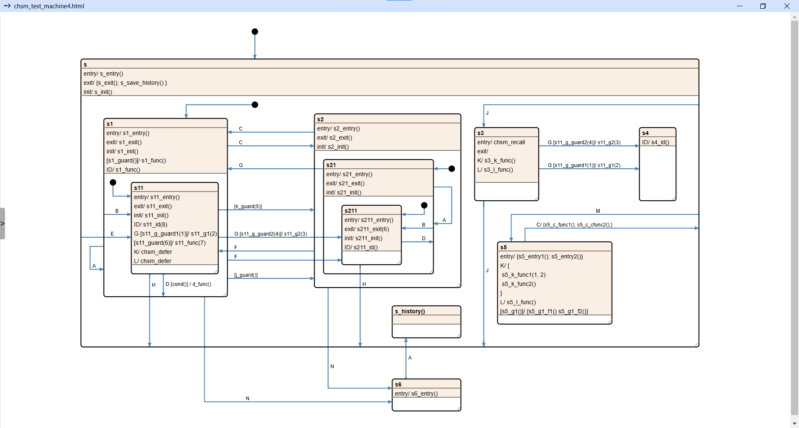

# Anatomy of a state machine

In this chapter, we’ll go through every state machine feature supported by the Cgen GUI to give you a full overview of what’s possible. We’ll use the state machine designed for testing C code generation, as it’s the most complex example in the repo.

If any concepts on this page seem unfamiliar, check out this Wikipedia article: [UML state machine](https://en.wikipedia.org/wiki/UML_state_machine)

For a deeper dive into state machines, I recommend reading Miro Samek's book on the topic: [Practical UML Statecharts in C/C++, 2nd Ed](https://www.state-machine.com/psicc2)

[Test machine html](../../crf/test/doc/chsm_test_machine4.html)


## Supported features

- Nested states
- Initial states
- Guards
- Multiple function calls in event handlers
- Entry, exit and init events
- Function and guard parameters
- Function call as state title (Not even remotely UML-compliant.)

Cgen mostly follows the UML statechart specification, but there are a few exceptions. We’ll highlight any sections where the behavior differs from the standard.

## Nested states

States can have child states. When you drag the parent, the child states move with it on the GUI. For event handling, child states inherit all event handlers from their parent states but can also override them.

For code generation, Cgen only keeps simple states (states without children) in the internal representation and in the generated code. All parent event handlers are added to these simple states, and transition paths are pre-calculated.

## Event handlers

In Cgen, event handlers come in two forms:

- **Event handlers without transitions:** These are written directly in the text block of a state and handle events without changing states.
- **Event handlers with transitions:** These are written in text blocks attached to transition arrows and handle events that trigger a state change.

"**Event handler syntax:** `EVENT_NAME [guard_func(guard_param)] {func1(func1_param); func2(func2_param)}`

Where:
- **EVENT_NAME**: The identifier of the event to be handled.
- **guard_func**: The guard function that checks if the transition should proceed.
- **guard_param**: Optional comma-separated parameters for the guard function.
- **funcX**: The function to be called when **EVENT_NAME** occurs and **guard_func** returns `true`.
- **funcX_param**: Optional comma-separated parameters for **funcX**.

The curly braces `{}` can be omitted if there’s only one function call. Semicolons and line breaks between functions are also optional."

In Cgen, guards are conditions that control whether a transition or action should occur when an event is received. They are essentially if-statements that check certain conditions before executing a transition.

Each event handler can have its own guard, and multiple handlers for the same event can each have a different guard. If more than one handler with guards matches an event, only one of the guards that evaluates as `true` will be executed. Cgen doesn’t guarantee any specific order for guard evaluations.

There can also be guards that aren’t linked to any specific event. These are known as *completion guards* and are evaluated after any event that doesn’t lead to a state transition. If a completion guard’s condition is met, it can trigger actions or transitions on its own, helping manage cases where further checks or cleanups are needed after regular event handling.

## Initial states

Initial states are represented by black dots and are used to select the starting child state within a parent state.

Rules for initial states (as enforced by the GUI):  
- Only one transition can be attached to each initial state  
- Each composite state can have only one initial state as a child  
- No transitions can target initial states

## Entry, exit and init events

In Cgen, **entry**, **exit**, and **init** events are special built-in events that help control state transitions and setup within the state machine. Unlike regular events, these can’t have guards, as they automatically trigger certain actions without needing any conditions.

- **entry**: This event is triggered automatically when entering a state. Any actions specified in the entry event are executed as soon as the state becomes active.
  
- **exit**: This event is triggered automatically when leaving a state. Actions in the exit event are executed right before the state becomes inactive, helping with cleanup or final tasks.
  
- **init**: This event is triggered the first time a state is entered, often used to transition immediately to an initial child state. The init event helps set up default paths and states within a composite state.

These events help manage transitions cleanly by automating setup and teardown actions within states.

## Function call as state title

A function call can be used as a state title to redirect transitions targeting that state. The function should return a value that acts as the state name in the generated code.

This feature was initially developed to implement *history* functionality. When a transition targets a history state, the end state becomes the last active state within the parent of that history state. For example, in our setup, the **exit** event handler of **s** saves the current state to an internal variable, and the `s_history()` function returns this variable, effectively redirecting the transition to the last active state."

This approach allows you to implement history functionality only when needed, without adding unnecessary complexity to the state machine framework.

## Detailed transition examples

In this section, we’ll walk through several examples where we take a state from the example state machine, dispatch events to it, and observe the results. We’ll pay special attention to which functions are called and in what order.

(The examples are auto generated into the [sm.doc](../../crf/test/build/sm.doc) file by the unit tests.)

Each subsection title will follow this format:  
**starting state** ← **EVENT1**, **EVENT2**... [guard() => true|false]

The functions called will be listed at the beginning of each section in a code block.

### **top** ← **INIT**

```
s_entry s_init s1_entry s1_init s11_entry s11_init
```

This is pretty straightforward: the initial state of the **top** background state is **s**, so we enter it by calling the **s_entry** event handler. Since **s** was the target of the transition, we then call the **s_init** handler, followed by the transition to **s**’s initial state, **s1**.
Now we enter **s1** by calling its entry and then init event handlers, transitioning to **s11**. We call **s11**'s entry and init handlers and then stop, as **s11** is a simple state with no children."

### **s11** ← **ID**

```
s11_id s11_guard k_guard s1_guard j_guard 
```

The ID event handler of **s11** is just a function call, but we can see that after calling the handler function, all *completion guards* of **s11** and its ancestors are evaluated.

### **s11** ← **D** [cond() => false]

```
cond s11_guard k_guard s1_guard j_guard 
```

In this example, we send the **D** event to **s11** and set the return value of the **cond()** guard to `false`.
We see that **cond** is called, as it’s the guard attached to the **D** event. But since it returns `false`, the handler function isn’t called, and the transition doesn’t execute. Since no state change occurred, all relevant *completion guards* are evaluated.

### **s11** ← **D** [cond() => true]

```
cond d_func s11_exit s1_init s11_entry s11_init s11_guard k_guard s1_guard j_guard
```

This time, the **cond()** guard evaluates to `true`. Since it does, **d_func** is called, and the transition executes to **s1**. Leaving **s11** triggers **s11_exit**. **s1** was the transition target, so we call **s1_init**, then **s11_entry**, **s11_init**, and finally the relevant *completion guards*.

### **s11** ← **A**

```
s11_exit s1_exit s1_entry s1_init s11_entry s11_init s11_guard k_guard s1_guard j_guard 
```

This is what happens when an event triggers a transition from a state's parent back to itself. The state and its parent are exited and then re-entered. Since the final state doesn’t change, the *completion guards* are called.

### **s11** ← **B**

```
s11_exit s11_entry s11_init s11_guard k_guard s1_guard j_guard
```

The transition handler for **B** is defined in **s1**, the parent of **s11**, and it points back to **s11**. **s11** is exited and then re-entered, and the *completion guards* are called.