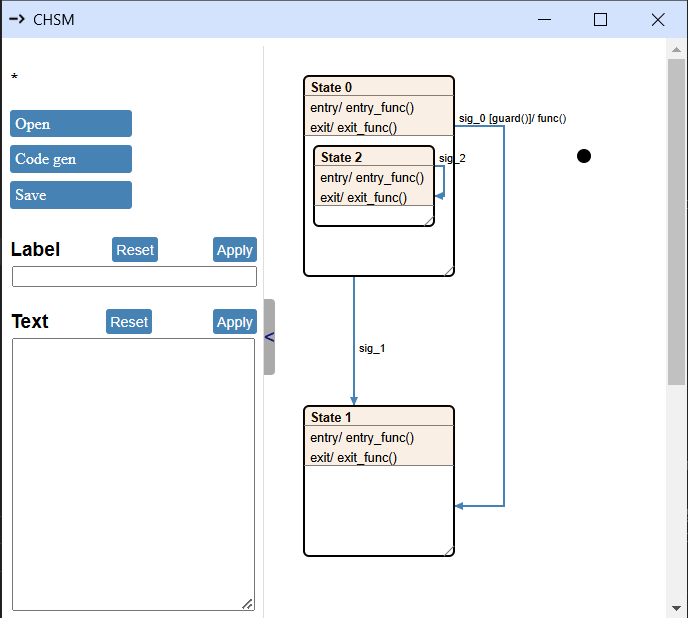
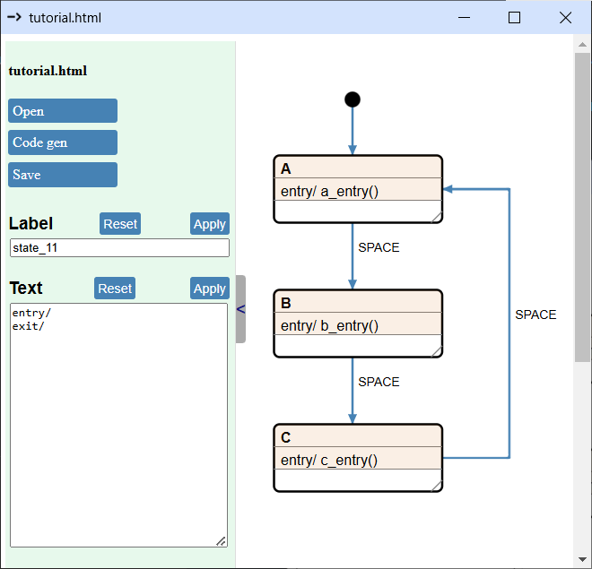

# Minimal Python code generation

In this chapter we draw a basic state machine, write a template, and set up some Python code to take the generated code for a spin.

If you’re not familiar with Python, no big deal. We’re keeping things simple with a ‘least amount of magic’ approach here, but if this is your first time with Jinja, I recommend skimming a few pages of the docs to have an overview:

[Jinja template design docs](https://jinja.palletsprojects.com/en/stable/templates/)

## Basic state machine

### Start the GUI

1. Go the the root directory of the CHSM repo
2. Run the following command: `python cgen\chsm_backend.py`
3. A browser window should pop up:



### Delete the default drawing

In the GUI, press `d`, then click on the `State 0` text or anywhere on its header. When your mouse enters the header area (where the text is), the entire border of the state will light up in red. Press `d` again to delete `State 1`. Repeat this process to delete the initial state—the black dot. Now you got nothing.

### Draw a simple state machine

The goal here is to make a state machine that prints A, then B, then C, then loops back to A, and so on—each time you press a button. Something like this:



Here is how you can build this:
1. Move your mouse to where you want a state, then press `s`. Click on the header to highlight the state in green. Fill in the `Label` and `Text` fields on the left, then hit the `Apply` buttons. Resize the state by dragging its lower-right corner. Repeat three times.
2. Add an initial state by pressing `i`.
3. Press `t` to connect states with transitions. As you route the transitions, each click locks in the last corner of the line.
4. To change a transition label, click on the transition line, edit the `Label` field, and hit the `Apply` button.
5. Click the `Save` button to save the drawing as an HTML file. For this tutorial, the drawing is saved as `project\doc\tutorial.html`.

### Let's setup code generation

1. In your project folder, create a directory called `.chsm`.
2. Inside `.chsm`, create a new JSON file named `settings.json`. Copy this inside:
    ``` json
    {
        "tutorial.html": {
            "drawing":	"tutorial.html",
            "jobs":	[
                {
                    "title":			"C code gen",
                    "output":			"../state_machine.py",
                    "template":			"python_template.jinja",
                    "template_params":  {},
                    "dump_ir":			true
                }
            ]
        }
    }
    ```
3. Also, inside `.chsm`, create a new file called `python_template.jinja`. For now let's just write this inside:
    ``` python
    # Generated code - any edits will be overwritten.
    ```
4. Click the `Code Gen` button. This should create the following files:
    - `state_machine.py` in the parent directory of .chsm
    - `tutorial.json` next to tutorial.html

`state_machine.py` only has the one line from our template, so nothing exciting has happened yet.

`tutorial.json`, on the other hand, contains the internal representation (IR) of the state machine. This file holds all the data we can use in our template. (Later, we can turn off IR JSON file generation by setting `"dump_ir"` to `false` in `settings.json`.)

### Let there be architecture

Yeah... something at least. It’s way easier to write a template when we have an example to look at first.

The main things to keep in mind when designing architecture for Cgen are:
1. **We can only generate entire files** - there’s no way to automatically update just sections of code.
2. **Only function calls are allowed in event handlers** - so, for example you can write `inc()` but not `i += 1` into an event handler.

All this means we’ll need at least two files: a generated one for the state machine code that calls the functions we write, and another for the function implementations and any code that feeds events into the state machine.

In this tutorial, we’ll use the following two files:

#### state_machine.py:
``` python
# Generated code - any edits will be overwritten.

class StateMachine:
    def __init__(self, user_obj):
        self.user_obj = user_obj
        self.state_func = self.state_top

    def state_top(self, event):
        if event == self.user_obj.EVENT_INIT:
            self.user_obj.a_entry()
            self.state_func = self.state_A

    def state_A(self, event):
        if event == self.user_obj.EVENT_SPACE:
            self.user_obj.b_entry()
            self.state_func = self.state_B

    def state_B(self, event):
        if event == self.user_obj.EVENT_SPACE:
            self.user_obj.c_entry()
            self.state_func = self.state_C

    def state_C(self, event):
        if event == self.user_obj.EVENT_SPACE:
            self.user_obj.a_entry()
            self.state_func = self.state_A
```
This is the final output we want our template to produce. Once everything is set up and working as expected, this file will be the result of our efforts!

The state machine is implemented as a class, with each state as a method. Each state method takes an event as a parameter and, based on that event, calls user-defined functions.

The class has two attributes:
- `state_func`: This acts as a function pointer, always pointing to the currently active state method.
- `user_obj`: This is the user-supplied object containing event identifiers and functions that the state machine can call.

Transitions are implemented by calling functions from `user_obj`. The state change itself happens by updating `state_func` to point to a new method.

It's important to note that we have an extra state method: `state_top`, which isn't shown in the drawing. `state_top` acts as the intrinsic "background state" and contains all the states we've drawn as its children. The implementation uses it to separate instance construction from state machine initialization.
When we create an instance of the `StateMachine` class, the initial state will be `state_top`. The transition to `state_A` will only occur if the state machine receives an `INIT` event.

---

#### main.py:
``` python
import time
import msvcrt
from state_machine

ESC_KEY = '\x1b'

class UserClass:
    EVENT_SPACE = ' '
    EVENT_INIT  = 'i'

    def a_entry(self):
        print('A')

    def b_entry(self):
        print('B')

    def c_entry(self):
        print('C')

if __name__ == '__main__':

    usr = UserClass()
    sm = state_machine.StateMachine(usr)
    last_key = None

    while True:
        if msvcrt.kbhit():
            last_key = msvcrt.getch().decode('utf-8')
            
            if last_key == ESC_KEY:
                print("Esc pressed, exiting...")
                break

        sm.state_func(last_key)
        last_key = None
        time.sleep(0.1)
 
```

This code has two main parts:
- `UserClass` is a collection of functions and event values that we want to pass to our state machine.
- The main program instantiates `UserClass` and `StateMachine`, then calls `state_func` every 100ms, also passing any keystrokes if there were any. The program quits when the user presses Escape.

We can try this code as-is. After starting, press **i** (the init event) to perform the initial transition, then keep pressing **space** to cycle through printing A, B, C, A, B, and so on.

### First template

Now we’re ready to write template code that actually does something. The first part is pretty straightforward:
``` jinja
# Generated code - any edits will be overwritten.

class StateMachine:
    def __init__(self, user_obj):
        self.user_obj = user_obj
        self.state_func = self.state_top
```

#### Add states

Next, we need to generate the methods in the class. The data for this is in `tutorial.json` - we just need to loop through all the items in the `states` key to grab the info we need. Let’s start by just generating the empty functions. Add this code to `python_template.jinja`:

``` jinja

    def state_{{ state.title }}(self, event):
        pass
        

```

Simple enough: for every item in the `states` dictionary we generate a function with a name prefixed by **state**. This is how the generated code looks now:
``` python
# Generated code - any edits will be overwritten.

class StateMachine:
    def __init__(self, user_obj):
        self.user_obj = user_obj
        self.state_func = self.state_top

    def state_A(self, event):
        pass
        
    def state_B(self, event):
        pass
        
    def state_C(self, event):
        pass
```

#### Add function calls

Now we need to loop through the signals in each state and add their handlers to the methods. Just like this:

``` jinja

    def state_{{ state.title }}(self, event):
        
        if event == self.user_obj.EVENT_{{signal.name}}:
            
            self.user_obj.{{func[0]}}({{func[1]}})
            
        


```

Yeah, looping through `signal.guards[""].funcs` might look a bit odd. The `guards[""]` part is used because the guards dictionary groups functions by condition. An empty string key (`""`) is like a catch-all—used when there’s no specific condition for those functions. So, `guards[""].funcs` gives us the functions that don’t depend on any guard condition. It’ll make more sense in the next chapter!

The function list consists of function name - parameter pairs, which is why we generate function calls with this line: `self.user_obj.{{func[0]}}({{func[1]}})`. Our state machine doesn’t use function parameters yet, but it’ll come in handy later.

Generated methods now look like this:
``` python
def state_A(self, event):
    if event == self.user_obj.EVENT_SPACE:
        self.user_obj.b_entry()
```

#### Add transitions

If we take a closer look at `tutorial.json`, we’ll see that a signal guard not only contains a list of functions but also includes the target state. We can use this to generate the state transition:

``` jinja

self.state_func = self.state_{{signal.guards[""].target_title}}

```

Generated output:
``` python
def state_A(self, event):
    if event == self.user_obj.EVENT_SPACE:
        self.user_obj.b_entry()
        self.state_func = self.state_B
```

#### Add top state

We are getting really close to a working code generator. The final piece of the puzzle is the `top` method. Here’s how we put it together:

``` jinja
    def state_top(self, event):
        if event == self.user_obj.EVENT_INIT:

            self.user_obj.{{func[0]}}({{func[1]}})

            self.state_func = self.state_{{data.states.__top__.sys_signals.init.target_title}}
```

We loop through the functions for the init transitions listed in `data.states.__top__.sys_signals.init.funcs`. For each function, we generate a call just like before. Then, we grab the title of the target state and create an assignment to carry out the state change.

Our template is finally complete, and it now looks like this:

``` jinja
# Generated code - any edits will be overwritten.

class StateMachine:
    def __init__(self, user_obj):
        self.user_obj = user_obj
        self.state_func = self.state_top

    def state_top(self, event):
        if event == self.user_obj.EVENT_INIT:

            self.user_obj.{{func[0]}}({{func[1]}})

            self.state_func = self.state_{{data.states.__top__.sys_signals.init.target_title}}


    def state_{{ state.title }}(self, event):
        
        if event == self.user_obj.EVENT_{{signal.name}}:
            
            self.user_obj.{{func[0]}}({{func[1]}})
            
            
            self.state_func = self.state_{{signal.guards[""].target_title}}
            
        


```

And the generated file:
``` python
# Generated code - any edits will be overwritten.

class StateMachine:
    def __init__(self, user_obj):
        self.user_obj = user_obj
        self.state_func = self.state_top

    def state_top(self, event):
        if event == self.user_obj.EVENT_INIT:
            self.user_obj.a_entry()
            self.state_func = self.state_A

    def state_A(self, event):
        if event == self.user_obj.EVENT_SPACE:
            self.user_obj.b_entry()
            self.state_func = self.state_B

    def state_B(self, event):
        if event == self.user_obj.EVENT_SPACE:
            self.user_obj.c_entry()
            self.state_func = self.state_C

    def state_C(self, event):
        if event == self.user_obj.EVENT_SPACE:
            self.user_obj.a_entry()
            self.state_func = self.state_A

```

### Template parameters

Our template is currently a bit rigid. For instance, naming all generated classes **StateMachine** isn’t ideal if you’re working with multiple state machine drawings. To address this, we can introduce parameters in the template, defined in the job descriptor. Since the job descriptor is specific to each drawing, it enables flexible output customization.

To customize the class name for each generated file, we’ll start by updating `settings.json`. Add a key-value pair to the `template_params` dictionary, like this:

``` json
"template_params":  {
    "class_name": "MyStateMachine"
},
```

Next update the template and change this row:

``` jinja
class StateMachine:
```

to this:

``` jinja
class {{data.template_params.class_name}}:
```

We are almost done. We just need to change `main.py` to use the new class name:

``` python
sm = state_machine.MyStateMachine(usr)
```

And done! This template is fully functional and ready to use, but there’s still a lot of untapped potential. We will expand it in the next chapters.

### Summary

Let's wrap things up with a quick recap of how Cgen code generation works:

1. **Draw the State Machine**: Start by creating your state machine diagram in the GUI.  
2. **Generate Code**: Press the `Code gen` button to begin the process.  
3. **Locate `settings.json`**: The application searches through `.chsm` folders in the file path to find the appropriate `settings.json` file.  
4. **Identify Jobs**: It reads the job list associated with your drawing from the settings file.  
5. **Process Jobs**: The listed jobs are executed sequentially. In this tutorial, we generated just one output file, but for a C implementation, multiple files like `.c` and `.h` might be necessary. Additionally, it's possible to export a **drawio** diagram for visual representation.  