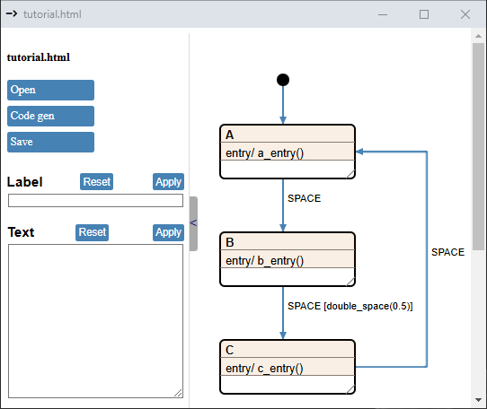
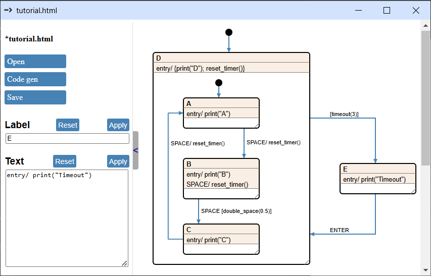
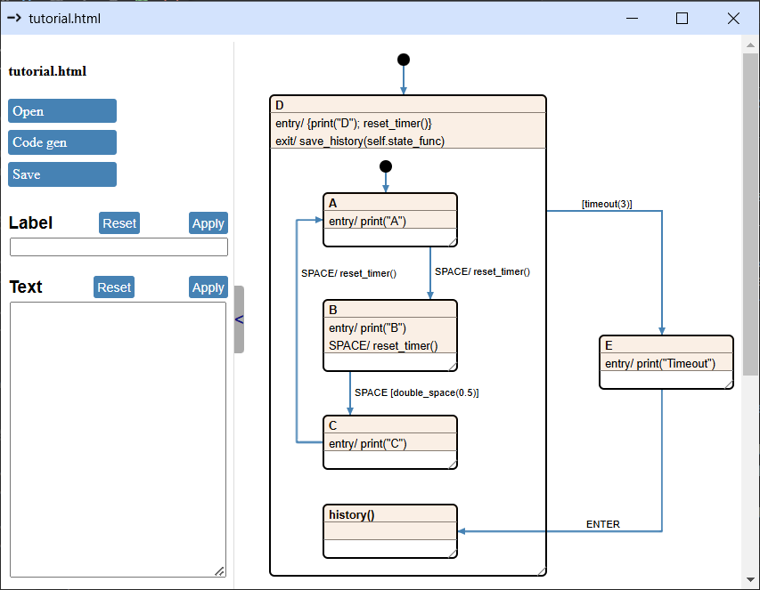
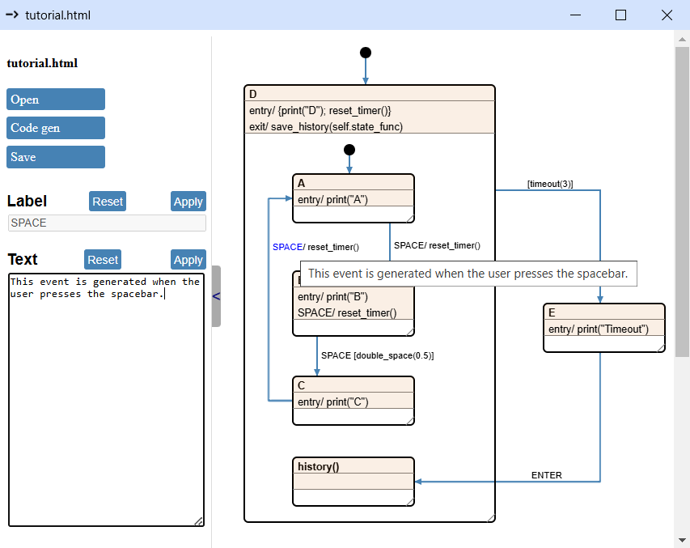

# Extended Python Code Generation

In this chapter, we’ll continue from where we left off in [Chapter 2](../ch2_minimal_python_codegen/minimal_python_codegen.md), expanding our template and Python code to support all Cgen features.

Here’s the state machine we finished with:


## Guards

Let's say we want to modify the state machine so that it only transitions from `B` to `C` if we press the `space` key twice in a short time, otherwise it stays in `B`.

To achieve this, we add a guard to the transition:


Now, If you just press the `Code gen` button you'll be rewarded with this ... thing in the console:

``` python
Traceback (most recent call last):
  File "d:\repo\HW\mp\python\lib\site-packages\eel\__init__.py", line 281, in _process_message
    return_val = _exposed_functions[message['name']](*message['args'])
  File "chsm_backend.py", line 421, in genereate_code
    project.generate_code()
  File "chsm_backend.py", line 354, in generate_code
    self._run_jobs()
  File "chsm_backend.py", line 348, in _run_jobs
    self._run_job(job)
  File "chsm_backend.py", line 343, in _run_job
    output_file.write(template.render(data=data))
  File "d:\repo\HW\mp\python\lib\site-packages\jinja2\environment.py", line 1301, in render
    self.environment.handle_exception()
  File "d:\repo\HW\mp\python\lib\site-packages\jinja2\environment.py", line 936, in handle_exception
    raise rewrite_traceback_stack(source=source)
  File "D:\repo\GITHUB\chsm\doc\ch4_extended_python_codegen\project\.chsm\python_template.jinja", line 19, in top-level template code
    
  File "d:\repo\HW\mp\python\lib\site-packages\jinja2\environment.py", line 485, in getattr
    return getattr(obj, attribute)
jinja2.exceptions.UndefinedError: 'dict object' has no attribute ''
```

Isn't that just beautiful? It isn't really, but all information we need for figuring out the problem is there. Focus on these lines:

``` python
  ...
  File "D:\repo\GITHUB\chsm\doc\ch4_extended_python_codegen\project\.chsm\python_template.jinja", line 19, in top-level template code
    
  ...
  jinja2.exceptions.UndefinedError: 'dict object' has no attribute ''
```

It means, that there is no `""` key in the `signal.guards` dictionary somewhere. Let's take a look into the [IR](project/doc/tutorial.json) and find the descriptor for state `B`:

``` json
"state_1": {
    "signals": {
        "SPACE": {
            "name": "SPACE",
            "guards": {
                "double_space()": {
                    "guard_func": "double_space",
                    "guard_param": "",
                    "funcs": [["c_entry", ""]],
                    "target": "state_2",
                    "target_title": "C",
                    "lca": "__top__",
                    "target_type": "normal"
                }
            }
        }
    },
    "guards": {},
    "title": "B",
    "num": 1
}
```

The issue lies in the `state_1.signals.SPACE.guards` dictionary, which contains only the key `double_space()`. However, the template assumes that a `""` key will always be present.

(I included this section mainly to show how template bugs can be resolved by simply checking the console. There’s also some IDE support for debugging Jinja templates, such as in VSCode.)

To resolve this, we can add an `if` statement around the signal code generator segment, like this:

``` jinja 

    
    self.user_obj.{{func[0]}}({{func[1]}})
    
    
    self.state_func = self.state_{{signal.guards[""].target_title}}
    

```

This ensures the code generator only attempts to process the `""` key if it exists in the `guards` dictionary. Now pressing the `Code gen` button will successfully generate code, but the `SPACE` event handler will be empty for state `B`. Not good.

What we’ll need to do is iterate through all the guards in a signal and handle the `""` case separately. These are the components of the solution:

### Iterate through the guards

``` jinja

...

```

Adding the `sort` filter at the end isn’t strictly necessary, but it ensures the generated code remains consistent even if you reorder the guards in the drawing. If you’re keeping the generated code in a version-controlled repository, this prevents irrelevant changes from cluttering your commits.

### Generate if statements for non-empty guards

``` jinja

  if self.user_obj.{{guard.guard_func}}({{guard.guard_param}}):
  ...

  ...

```

### Generate function calls and state change

This is the same as before:

``` jinja
    
self.user_obj.{{func[0]}}({{func[1]}})
    
    
self.state_func = self.state_{{guard.target_title}}
    
```

### Put it all together

``` jinja


    
if self.user_obj.{{guard.guard_func}}({{guard.guard_param}}):
        
    self.user_obj.{{func[0]}}({{func[1]}})
        
        
    self.state_func = self.state_{{guard.target_title}}
        
    
        
self.user_obj.{{func[0]}}({{func[1]}})
        
        
self.state_func = self.state_{{guard.target_title}}
        
    

```

In the `else` branch of the `` statement, we adjusted the code indentation to satisfy the Python interpreter, but that’s the only noteworthy change here.

The generated code looks allright:

``` python
def state_B(self, event):
    if event == self.user_obj.EVENT_SPACE:
        self.user_obj.reset_timer()
        if self.user_obj.double_space():
            self.user_obj.print("C")
            self.state_func = self.state_C
```

This only leaves implementing the `double_space` method in our `UserClass` ... class. Yeah, naming things is hard. Implementing this, not so much:

``` python
    def __init__(self):
        self.space_ts = time.time()

    def double_space(self):
        ts = time.time()
        if (ts - self.space_ts) < 0.5:
            return True
        
        self.space_ts = ts
        return False
```

In the constructor, we store a timestamp in the `space_ts` attribute. Each time the `double_space` method is called, we check if the current timestamp is within 0.5 seconds of the previous one. If it is, we return `True`; otherwise, we update `space_ts` and return `False`.

And now our code is working as expected.

## Guard with parameter

All is well, but that 0.5s threshold is hard coded into the guard method. We could just move it to the drawing to make it more obvious.



Press the `Code gen` button and check the `state_machine.py` file. The `double_space` function call should now include `0.5` as a parameter. Since our template already handles function and guard parameters, no modifications were needed.  

Next, let's update our `main.py` to accommodate this change:

``` python
def double_space(self, threshold):
    ts = time.time()
    if (ts - self.space_ts) < threshold:
        return True
    
    self.space_ts = ts
    return False
```

That wasn’t too difficult.

## Completion guards

Let’s introduce a timeout reaction to our state machine. If the user doesn’t press `SPACE` within 3 seconds, a "Timeout" message will be displayed. The A-B-C loop will then pause and will only resume when the user presses `ENTER`.

The timeout functionality can be implemented using a completion guard that gets evaluated every time the `state_func` method is called in the state machine and no state change  Instead of manually adding this guard to each state, we can create a parent state and attach the guard to it. 

While we’re at it, let’s streamline the `UserClass` by leveraging the function parameter capability. We’ll replace all the `x_entry()` calls with `print("x")` calls, reducing the need for separate functions for each state. This leaves us with just one function to implement instead of one for every state.



To make the `timeout` guard work, we need to reset the timer every time `SPACE` is pressed. This can be achieved by calling `reset_timer` within each `SPACE` event handler.
The only notable change here is adding the `SPACE` event handler to the body of `B`. This ensures the timer resets even if `SPACE` is pressed too late to trigger the transition to `C`.

Here is the updated `UserClass` after the refactor and the inclusion of the two new functions:

``` python
class UserClass:
    EVENT_SPACE = ' '
    EVENT_INIT  = 'i'
    EVENT_ENTER = '\r'

    def __init__(self):
        self.space_ts = time.time()
        self.timeout_ts = 0

    def double_space(self, threshold):
        ts = time.time()
        if (ts - self.space_ts) < threshold:
            return True
        
        self.space_ts = ts
        return False

    def print(self, s):
        print(s)

    def reset_timer(self):
        self.timeout_ts = time.time()

    def timeout(self, t):
        if (time.time() - self.timeout_ts) > t:
            return True
        
        return False
```

In the template, we iterate through the `guards` dictionary of each state and generate code for its values. Since we know there won't be any empty strings as guards, this simplifies the task. Here's the code:

``` jinja

if self.user_obj.{{guard.guard_func}}({{guard.guard_param}}):
    
    self.user_obj.{{func[0]}}({{func[1]}})
    
    
    self.state_func = self.state_{{guard.target_title}}
    

```

## Function call as state title

Our code works as intended, but it would be even better if it could return to the previously active state after a timeout, instead of always defaulting to `A`.

We can solve this by introducing support for function calls as state titles. To do this, we add a new child to `D` and set its title to `history()`. Then, in the `exit` handler of `D`, we save the current state function by calling a method from the user class and passing the state pointer as a parameter.



We need to modify the template to generate a function call for transitions targeting the `history()` state. In our template, there are three instances of the following snippet:  

```jinja

...

```

We'll replace each occurrence with this updated block (adjusting the indentation as necessary):  

```jinja

  self.state_func = self.user_obj.{{guard.target_title}}(event, {{guard.target_param}} )

  self.state_func = self.state_{{guard.target_title}}

```

Pretty straightforward. When the `target_type` is `"call"`, we generate a function call. Otherwise, we fall back to a simple assignment as before.

Finally the update to UserClass:

``` python
class UserClass:
    ...

    def __init__(self):
        ...
        self.saved_state = None
        
    def save_history(self, state):
        self.saved_state = state

    def history(self, event):
        return self.saved_state

    ...
```
We simply take the state passed to the `save_history` method, store it in an attribute, and return it when `history` is called.

## Generating a user base class

There is only one thing left to add to our template: generating a base class for the user interface. Up until this point, we’ve been eyeballing the drawing or the generated state machine code to figure out the structure of the `UserClass`. Wouldn't it be convenient to have a base class that already includes all the signals and methods?

To make this feature genuinely useful, let’s add a few notes to the drawing:



You can add notes to a signal or function by clicking on its name (not the line) and then typing in the `Text` field. There's no need to press the `Apply` button; the notes will be saved automatically. (Unfortunatelly adding notes to state titles is not possible at the moment.)

We aim to generate something like this:

``` python
class MyStateMachineInterface:
    EVENT_INIT  = None # Init event
    EVENT_SPACE = None # This event is generated when the user presses the spacebar.
    EVENT_ENTER = None # This event is generated when the user presses the enter button.

    def reset_timer(self):
        """Save the actual time in an internal variable."""
        pass

    def print(self, *args, **kwargs):
        """Just print the string parameter in the console."""
        pass

    def save_history(self, *args, **kwargs):
        """Save the actual state into an internal variable."""
        pass

    def timeout(self, *args, **kwargs):
        """Return true, if the elapsed time since the last reset_timer call is greater than the time given in the argument."""
        return False

    def double_space(self, *args, **kwargs):
        """Return ture, if the spacebar was pressed twice within the time window given as parameter."""
        return False

    def history(self):
        """Return a state method."""
        return None
```

Let's get to it. First just generate the class and the signals with the notes:

``` jinja
class {{data.template_params.class_name}}Interface:
    EVENT_INIT  = None # Init event
    
    EVENT_{{signal}} = None # {{data.notes[signal]}}
                            
    
```

Next go through `user_funcs`, `user_guards` and just generate the methods:

``` jinja
    
    def {{func}}(self):
        
        """{{data.notes[func]}}"""
        
        pass

    
    
    
    def {{func}}(self):
        
        """{{data.notes[func]}}"""
        
        return False

    
```

Here, the two for-loops are nearly identical; the only difference is that for guards, a `return` statement is included instead of a simple `pass`.

Generating code for the `user_inc_funcs` and `user_inc_guards` are almost the same. However, since these methods accept arguments of unspecified types, we just drop in the parameter black hole: `*args, **kwargs`. Those will eat up any arguments thrown at them.


``` jinja
    
    def {{func}}(self, *args, **kwargs):
        
        """{{data.notes[func]}}"""
        
        pass

    

    
    def {{func}}(self, *args, **kwargs):
        
        """{{data.notes[func]}}"""
        
        return False

    
```

And the final touch is generating methods for function call states:

``` jinja
    
    def {{state.title}}(self):
        """Return a state method."""
        return None
    
```

If we make our `UserClass` inherit `state_machine.MyStateMachineInterface` our IDE can help us displaying docstrings for the methods:

``` python
class UserClass(state_machine.MyStateMachineInterface):
    ...
```

