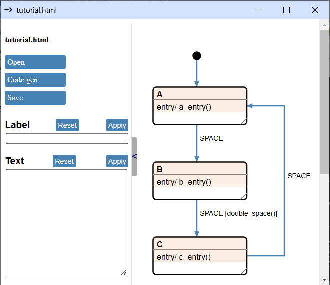

# Extended Python Code Generation

In this chapter, we’ll continue from where we left off in [Chapter 2](../ch2_minimal_python_codegen/minimal_python_codegen.md), expanding our template and Python code to support all Cgen features.

Here’s the state machine we finished with:


## Guards

Let's say we want to modify the state machine so that it only transitions from `B` to `C` if we press the `space` key twice in a short time, otherwise it stays in `B`.

To achieve this, we add a guard to the transition:



Now, If you just press the `Code gen` button you'll be rewarded with this ... thing in the console:

``` python
Traceback (most recent call last):
  File "d:\repo\HW\mp\python\lib\site-packages\eel\__init__.py", line 281, in _process_message
    return_val = _exposed_functions[message['name']](*message['args'])
  File "chsm_backend.py", line 421, in genereate_code
    project.generate_code()
  File "chsm_backend.py", line 354, in generate_code
    self._run_jobs()
  File "chsm_backend.py", line 348, in _run_jobs
    self._run_job(job)
  File "chsm_backend.py", line 343, in _run_job
    output_file.write(template.render(data=data))
  File "d:\repo\HW\mp\python\lib\site-packages\jinja2\environment.py", line 1301, in render
    self.environment.handle_exception()
  File "d:\repo\HW\mp\python\lib\site-packages\jinja2\environment.py", line 936, in handle_exception
    raise rewrite_traceback_stack(source=source)
  File "D:\repo\GITHUB\chsm\doc\ch4_extended_python_codegen\project\.chsm\python_template.jinja", line 19, in top-level template code
    
  File "d:\repo\HW\mp\python\lib\site-packages\jinja2\environment.py", line 485, in getattr
    return getattr(obj, attribute)
jinja2.exceptions.UndefinedError: 'dict object' has no attribute ''
```

Isn't that just beautiful? It isn't really, but all information we need for figuring out the problem is there. Focus on these lines:

``` python
  ...
  File "D:\repo\GITHUB\chsm\doc\ch4_extended_python_codegen\project\.chsm\python_template.jinja", line 19, in top-level template code
    
  ...
  jinja2.exceptions.UndefinedError: 'dict object' has no attribute ''
```

It means, that there is no `""` key in the `signal.guards` dictionary somewhere. Let's take a look into the [IR](project/doc/tutorial.json) and find the descriptor for state `B`:

``` json
"state_1": {
    "signals": {
        "SPACE": {
            "name": "SPACE",
            "guards": {
                "double_space()": {
                    "guard_func": "double_space",
                    "guard_param": "",
                    "funcs": [["c_entry", ""]],
                    "target": "state_2",
                    "target_title": "C",
                    "lca": "__top__",
                    "target_type": "normal"
                }
            }
        }
    },
    "guards": {},
    "title": "B",
    "num": 1
}
```

The issue lies in the `state_1.signals.SPACE.guards` dictionary, which contains only the key `double_space()`. However, the template assumes that a `""` key will always be present. 

To resolve this, we can add an `if` statement around the signal code generator segment, like this:

``` jinja 

    
    self.user_obj.{{func[0]}}({{func[1]}})
    
    
    self.state_func = self.state_{{signal.guards[""].target_title}}
    

```

This ensures the code generator only attempts to process the `""` key if it exists in the `guards` dictionary. Now pressing the `Code gen` button will successfully generate code, but the `SPACE` event handler will be empty for state `B`. Not good.

What we’ll need to do is iterate through all the guards in a signal and handle the `""` case separately. These are the components of the solution:

### Iterate through the guards

``` jinja

...

```

Adding the `sort` filter at the end isn’t strictly necessary, but it ensures the generated code remains consistent even if you reorder the guards in the drawing. If you’re keeping the generated code in a version-controlled repository, this prevents irrelevant changes from cluttering your commits.

### Generate if statements for non-empty guards

``` jinja

  if self.user_obj.{{guard.guard_func}}({{guard.guard_param}}):
  ...

  ...

```

### Generate function calls and state change

This is the same as before:

``` jinja
    
self.user_obj.{{func[0]}}({{func[1]}})
    
    
self.state_func = self.state_{{guard.target_title}}
    
```

### Put it all together

``` jinja


    
if self.user_obj.{{guard.guard_func}}({{guard.guard_param}}):
        
    self.user_obj.{{func[0]}}({{func[1]}})
        
        
    self.state_func = self.state_{{guard.target_title}}
        
    
        
self.user_obj.{{func[0]}}({{func[1]}})
        
        
self.state_func = self.state_{{guard.target_title}}
        
    

```

In the `else` branch of the `` statement, we adjusted the code indentation to satisfy the Python interpreter, but that’s the only noteworthy change here.

The generated code looks allright:

``` python
def state_B(self, event):
    if event == self.user_obj.EVENT_SPACE:
        if self.user_obj.double_space():
            self.user_obj.c_entry()
            self.state_func = self.state_C
```

This only leaves implementing the `double_space` method in our `UserClass` ... class. Yeah, naming things is hard. Implementing this, not so much:

``` python
    def __init__(self):
        self.space_ts = time.time()

    def double_space(self):
        ts = time.time()
        if (ts - self.space_ts) < 0.5:
            return True
        
        self.space_ts = ts
        return False
```

In the constructor, we store a timestamp in the `space_ts` attribute. Each time the `double_space` method is called, we check if the current timestamp is within 0.5 seconds of the previous one. If it is, we return `True`; otherwise, we update `space_ts` and return `False`.

And now our code is working as expected, but that 0.5s threshold is hard coded into the guard method. We could just move it to the drawing to make it more obvious.


 

