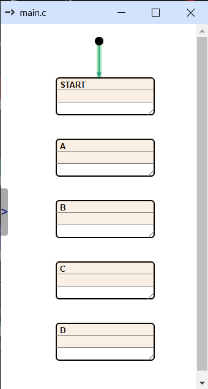
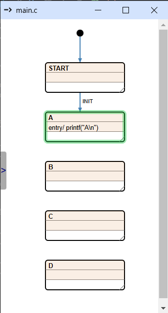
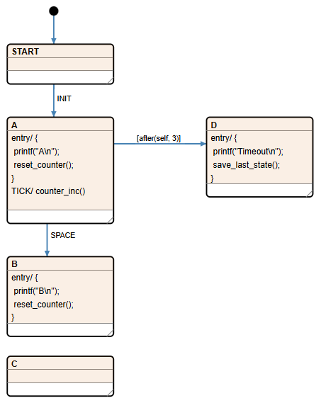
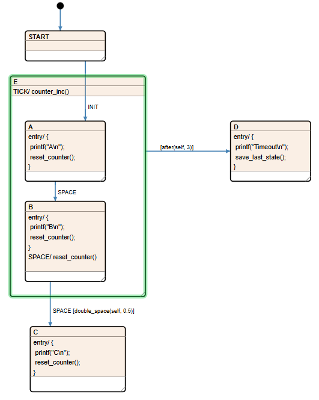
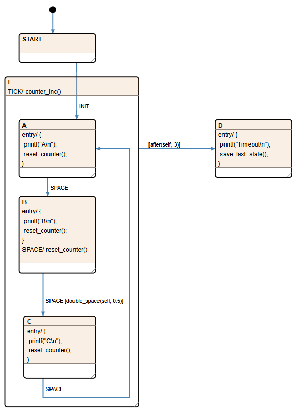
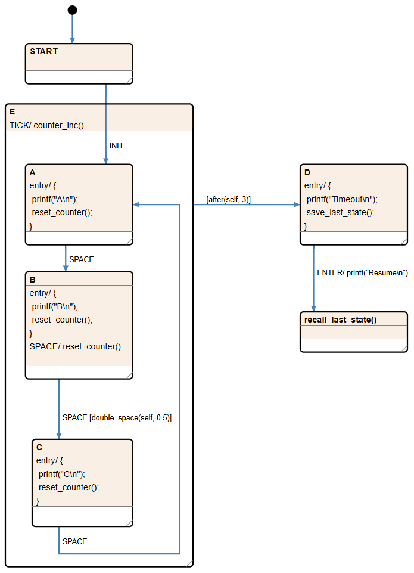

# C switch-case state machine refactor

This tutorial shows how to refactor a classic switch-case state machine into a visual representation that can generate the state machine code. This approach provides accurate documentation of the code’s behavior and can make future modifications easier and less error-prone.

Let's see the patient: [orig_main.c](project/orig_main.c)

The key parts to note are the `state_ten` and `event_ten` types, along with the `state_machine` function. Their roles are clear in the program, so let’s dive right into migrating the logic to Cgen.

## Set up a project

1. Create a `.chsm` and a `doc` directory.
2. Create a `settings.json` file in the `.chsm` folder with the following content:
``` json
{
	"main.c": {
		"drawing":	"doc/main.html",
		"jobs":	[
			{
				"title":			"Type generator",
				"output":			"main.c",
				"template":			"main_types.jinja",
                "dump_ir":          true,
                "insert":            {
                    "start_mark":   "/* State and event types (generated code - do not edit)*/",
                    "end_mark":     "/* End of generated code */"
                }
			},
			{
				"title":			"State machine function generator",
				"output":			"main.c",
				"template":			"main_sm.jinja",
                "insert":            {
                    "start_mark":   "/* State machine (generated code - do not edit)*/",
                    "end_mark":     "/* End of generated code */"
                }
			}
		]
	}
}
```
3. Next, create the necessary template files in the `.chsm` folder. We'll need two:  
    - **`main_types.jinja`**: For generating the types.  
    - **`main_sm.jinja`**: For generating the state machine function.

4. Insert the `start_mark` and `end_mark` strings enclosed in comments into `main.c`. Cgen will look for those and insert the generated text between the marked lines.

## Start the drawing

Start **Cgen** and open `main.c`.  

From the `state_ten` enum, we can identify five states: `START`, `A`, `B`, `C`, and `D`. Begin by creating these states in your diagram. Then, add an initial state and connect it to the `START` state. For now, you can remove the default empty event handlers.  

Your setup should look like this:  



## Transfer the switch-case code into drawing

Let’s examine the code for the `START` state:  

```c
case STATE_START:
    switch (event_en)
    {
        case EVENT_INIT:
            self->state_en = STATE_A;
            printf("A\n");
            break;
    }
    break;
```  

The `START` state has just one event handler for the `INIT` event. It transitions to state `A` and prints "A". This `printf` call acts as the `entry` event handler for state `A`.  

In your drawing, represent this by:  
1. Adding a transition from `START` to `A` for the `INIT` event.  
2. Including an `entry` action for state `A` with the text `printf("A\n")`.  

Your updated drawing should now reflect this logic.



Next up is state `A`:

``` c
case STATE_A:
    switch (event_en)
    {
        case EVENT_SPACE:
            self->state_en = STATE_B;
            printf("B\n");
            self->counter_u32 = 0;
            break;

        case EVENT_TICK:
            self->counter_u32++;
            break;
    }

    if (self->counter_u32 > 3)
    {
        self->history_en = self->state_en;
        self->state_en = STATE_D;
        printf("Timeout\n");
    }
    break;

```

Let's transfer this to the drawing step by step:  

- The `SPACE` event is handled by a transition to state `B`. The code inside the `case` statement is actually the `entry` event handler for `B`. The **printf** call can be written as is, but zeroing the counter should be factored into a small function (**reset_counter**).  
- The `TICK` event handler calls **counter_inc** to increment the counter.  
- The `if` statement becomes a guard condition for a transition to state `D`. Just like with the `SPACE` event, all the code inside will be executed by the `entry` event handler of `D`.

Here is how our state machine looks now:



Note that the `save_last_state` function is called in the `entry` handler of state `D`. This might seem counterintuitive at first, but the `entry` event handler always executes **before** the actual transition happens. This means that when `save_last_state` is called, the `state_en` variable still holds `STATE_A`.

And here are the small helper functions we need:

``` C
void reset_counter(data_tst* self)
{
    self->counter_u32 = 0;
}

void counter_inc(data_tst* self)
{
    self->counter_u32++;
}

void save_last_state(data_tst* self)
{
    self->history_en = self->state_en;
}

bool after(data_tst* self, uint32_t t)
{
    return self->counter_u32 > t;
}
```

Let's continue with `STATE_B`:

``` C
case STATE_B:
    switch (event_en)
    {
        case EVENT_SPACE:
            self->counter_u32 = 0;

            if (double_space(self, 0.5))
            {
                self->state_en = STATE_C;
                printf("C\n");
            }
            break;

        case EVENT_TICK:
            self->counter_u32++;
            break;
    }

    if (self->counter_u32 > 3)
    {
        self->history_en = self->state_en;
        self->state_en = STATE_D;
        printf("Timeout\n");
    }
    break;
```

For state `B` the `TICK` event handler, and the if block after the `switch` statement are the same as for `A`. The easiest way to handle this, is to move the handler and the guard to a new parent state that includes `A` and `B`.

The `SPACE` event handler is a bit different than previously. The transition to state `C` is guarded by a **double_space** function call, but the counter have to be reset every time.

Here is how this can be represented in the drawing:



Ok, not much else is left. Let's see state `C`:

``` c
case STATE_C:
    switch (event_en)
    {
        case EVENT_SPACE:
            self->state_en = STATE_A;
            printf("A\n");
            self->counter_u32 = 0;
            break;

        case EVENT_TICK:
            self->counter_u32++;
    }

    if (self->counter_u32 > 3)
    {
        self->history_en = self->state_en;
        self->state_en = STATE_D;
        printf("Timeout\n");
    }
    break;
```

This does pretty much the same as state `A`, so in the drawing we only need to extend state `E` to include `C` as a child, then add the transition to `A`:



And the last state is `D`:

``` c
case STATE_D:
    switch (event_en)
    {
        case EVENT_ENTER:
            self->state_en = self->history_en;
            printf("Resume\n");
            self->counter_u32 = 0;
            break;
    }
    break;
```

This one is a bit more interesting. Only the `ENTER` event is handled by returning to the last active state inside `E` and printing a string. This is actually the original use case for the function call state title feature so let's use that. Add
a new state under `D` and use a function call as title:



`recall_last_state` is trivial. It just returns the previously stored state. During code generation we can determine if a
state title is actually a function call and instead of just overwriting the value of `self->state_en` with the title of
the target state we can generate a line like `self->state_en = recall_last_state(self)`. Anyway, here is the code:

``` c
void recall_last_state(data_tst* self)
{
    return self->history_en;
}
```

## Write the code generation templates

The drawing is finished so its time to generate some code. Let's start with generating the enum types.

### Enums

We need 2 enum types, one with the state names and another with the event names. To make it easier to write
templates for custom state machines there is a collection of jinja snippets we can use here:
[chsm_template_snippets.jinja](../../cgen/templates/chsm_template_snippets.jinja)

There are two snippets here that are interesting for us now. One extracts state names and another extracts
event names:

``` jinja
{# Loop through all the normal states sorted by title and output the name in uppercase #}

    {{state.title.upper()}},



{# Loop through all the signals in the drawing sorted by name and output the signal. #}

    {{sig}}, 

```

With a few simple edits we are done:

``` jinja
{# Generate states. #}
typedef enum state_ten
{

    STATE_{{state.title.upper()}},

} state_ten;

{# Generate events. #}
typedef enum event_ten
{

    EVENT_{{sig}}, 

} event_ten;
```

Type names and prefixes are hard coded, but it is fine since this is a one-off template.

### State machine function

This is going to be a bit harder, than the previous one... Let's start with the easy part. Using the snippet that
lists all states we can write the frame of the function:

``` jinja
void state_machine(data_tst* self, event_ten event_en)
{
    switch(self->state_en)
    {

        case STATE_{{state.title.upper()}}:
            switch (event_en)
            {
            }
            break;


    }

    if (EVENT_EXIT == event_en)
    {
        self->exit_b = true;
    }
}
```

No we can use the state function generator snippet and extract the part that ouputs the code for the event handlers:
