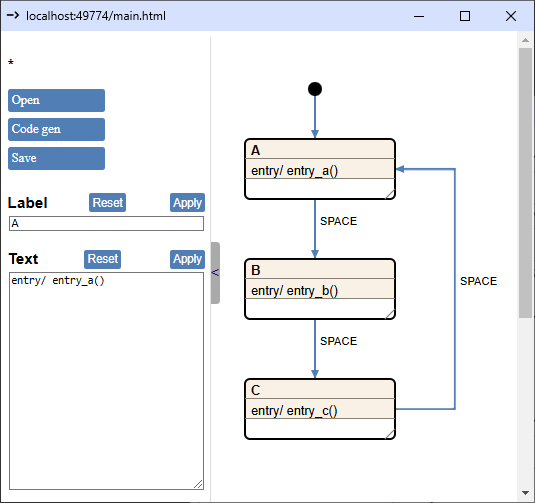

# Cgen tutorial

Goal: Create a wildly complex but easy-to-follow state machine that shows off as many Cgen features as possible — even if the state machine itself is completely pointless.

We'll use the GUI to sketch out our state machine and, along the way, put together a Python code generation template.

Let's go!

## Start the GUI

1. Go the the root directory of the CHSM repo
2. Run the following command: `python cgen\chsm_backend.py`
3. A browser window should pop up:


## Delete the default drawing

In the GUI, press `d`, then click on the `State 0` text or anywhere on its header. When your mouse enters the header area (where the text is), the entire border of the state will light up in red. Press `d` again to delete `State 1`. Repeat this process to delete the initial state—the black dot. Now you got nothing.

## Draw a simple state machine

The goal here is to make a state machine that prints A, then B, then C, then loops back to A, and so on—each time you press a button. Something like this:



Here is how you can build this:
1. Move your mouse to where you want a state, then press `s`. Click on the header to highlight the state in green. Fill in the `Label` and `Text` fields on the left, then hit the `Apply` buttons. Resize the state by dragging its lower-right corner. Repeat three times.
2. Add an initial state by pressing `i`.
3. Press `t` to connect states with transitions. As you route the transitions, each click locks in the last corner of the line.
4. To change a transition label, click on the transition line, edit the `Label` field, and hit the `Apply` button.
5. Click the Save button to save the drawing as an HTML file. For this tutorial, the drawing is saved as `doc\project\doc\tutorial.html`.

## Let's generate some code

1. In your project folder, create a directory called `.chsm`.
2. Inside `.chsm`, create a new JSON file named `settings.json`. Copy this inside:
    ```
    {
        "tutorial.html": {
            "drawing":	"tutorial.html",
            "jobs":	[
                {
                    "title":			"C code gen",
                    "output":			"../state_machine.py",
                    "template":			"python_template.jinja",
                    "template_params":  {},
                    "dump_ir":			true
                }
            ]
        }
    }
    ```
3. Also, inside `.chsm`, create a new file called `python_template.jinja`. For now let's just write this inside:
    ```
    # Generated code - any edits will be overwritten.
    ```
4. Click the `Code Gen` button. This should create the following files:
    - `state_machine.py` in the parent directory of .chsm
    - `tutorial.json` next to tutorial.html

`state_machine.py` only has the one line from our template, so nothing exciting has happened yet.

`tutorial.json`, on the other hand, contains the internal representation (IR) of the state machine. This file holds all the data we can use in our template. (Later, we can turn off IR JSON file generation by setting `"dump_ir"` to `false` in `settings.json`.)

## Code generation overview

When the user clicks the _Code gen_ button in the GUI, the following process occurs:

1. The Python application receives the raw drawing data in JSON format. This data focuses on the graphical representation of the state machine and is generally not well-suited for direct code generation.
2. The drawing is processed to create an Internal Representation (IR) in JSON format. In this IR, functions called during transitions are resolved, and the hierarchical state structure is flattened, keeping only the leaf states.
3. For each generated file, an output 'job' must be defined in a JSON file named settings.json located within a .chsm directory. The job descriptor includes the output path, the Jinja template to be used, and any optional parameters for the template.